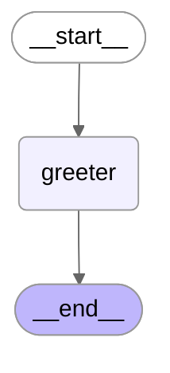
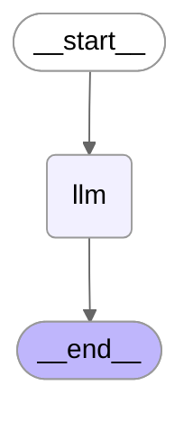
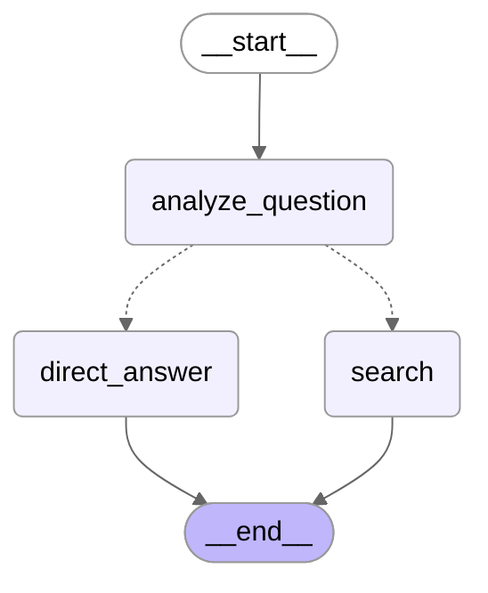
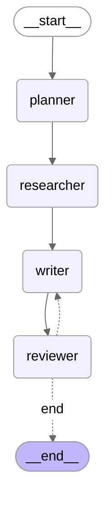
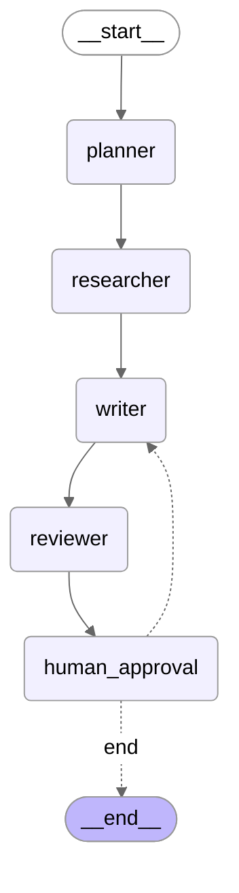

# Learning LangGraph

This repo is just me working through a tutorial on [LangGraph](https://youtu.be/dQw4w9WgXcQ?si=UeIkoAnAljXxXQmS&t=44s).

I used AnthropicAI and a python virtual environment.

## Initial Setup

```bash
python -m venv .venv
source .venv/bin/activate
pip install -r requirements.txt
echo "ANTRHOPIC_API_KEY='your_api_key_here'" > .env
```

The only required env is the `ANTHROPIC_API_KEY`, but you can also set:

- `ANTHROPIC_MODEL`
- `LOG_LEVEL`
- `LOG_FILE`

## First Example

Sample usage and output:

```bash
python first_graph.py 
```

Graph architecture:



Example output:

```text
Hello, Alice, or should I say, 'Hello World!'
```

## Second Example

This example actually invokes and LLM to get a response to the question "Where can
I find buried treasure?"

```bash
python second_graph.py 
```

Graph architecture:



I get bored with the 'helpful assistant' trope, so made mine a sea pirate. Example output:

```text
Ahoy there, matey! If ye be seekin' buried treasure, here be some places to set yer sights:

**The Classic Hunting Grounds:**
- **Desert islands** with palm trees and fresh water - X marks the spot on many an old map!
- **Coastal caves** where the tide don't reach - perfect for stashin' plunder
- **Old shipwreck sites** - many a vessel went down with her cargo still aboard
- **Rocky coves** and hidden beaches known only to those who sailed these waters before

**What Ye Need:**
- A proper treasure map (the older and more worn, the better!)
- A trusty compass and sharp eye for landmarks
- A sturdy shovel for diggin'
- Maybe a crew ye can trust... though that be the hardest treasure to find!

**Words of Wisdom:**
Keep yer eyes peeled for:
- Unusual rock formations
- Dead trees or markers
- Paces from the shoreline (pirates loved their steps - "40 paces north from the skull rock!")

But I'll tell ye true - the REAL treasure be the adventure itself, the salt spray on yer face, and the freedom of the open seas! 

Now, are ye lookin' for actual historical treasure hunting spots, or just enjoyin' the pirate spirit? ⚓🏴‍☠️
```


## Third Example

This example uses conditional logic: it decides if a web search is
needed in order to answer the question, and follows a path based on that.

The example questions are:

1. What is 2 - 9?
2. What's the latest news in deep sea exploration?

```bash
python third_graph.py
```

Graph architecture:



Thies example uses DuckDuckGo for web searches, and I didn't take the time
to optimize the search prompt, so the results are a bit hit-and-miss.

Example output:

```text
$ python third_graph.py
Asking question: What is 2 - 9?
14:16:56  INFO - third_graph.py:70 route_question - Routing to direct answer node.
Direct answer result: 2 - 9 = -7
Asking question: What's the latest news in deep sea exploration?
14:17:03  INFO - third_graph.py:35 analyze_question - Question requires search.
14:17:03  INFO - third_graph.py:68 route_question - Routing to search node.
Search answer result: Here are 4 search results from DuckDuckGo:
1. deep sea mining News and Opinion | Common Dreams - https://www.commondreams.org/tag/deep-sea-mining
2. What’s the Latest in Deep Sea Exploration Technology and - https://westsidelounge.com/news/whats-the-latest-in-deep-sea-exploration-technology-and-its-impact-on-uk-research.php
3. Future of deep-sea mining stands at a crucial juncture - https://phys.org/news/2024-11-future-deep-sea-crucial-juncture.html
4. Research team discovers more than 50 potentially new deep-sea - https://phys.org/news/2024-04-team-potentially-deep-sea-species.html
```


## Fourth Example: Iterative refinement with reviewer feedback

This example works like a research assistant, refining answer to the question
"What are the benefits of deadlifts and squats for building overall strength?", and responding in the
style of Edgar Allan Poe.

```bash
python fourth_graph.py
```

Graph architecture:



Here's an example final answer:

<details>
<summary>Click to expand final answer</summary>

# The Terrible Truth of Iron: A Confession Most Dreadful

*Being a revelation of the deadlift and squat, those twin instruments of exquisite torment*

---

True!—nervous—very, very dreadfully nervous I have been and am about the subject of strength; but why will you say that I am mad? The disease had sharpened my senses—not destroyed—not dulled them. Above all was my understanding of the barbell acute. I heard all things in the iron temple and the gymnasium. I heard things in the research journals. How, then, am I mad? Hearken! and observe how healthily—how calmly I can tell you of these two movements that have consumed my very soul.

## I. The Obsession Begins—The Compound Nature of My Torment

It is impossible to say how first the idea entered my brain; but once conceived, it haunted me day and night. Object there was none. Passion there was none. I loved the deadlift. I loved the squat. They had never wronged me. Yet I became possessed—utterly, irrevocably possessed—by the knowledge of their terrible power over the human form.

These movements—oh, how shall I describe them?—are not as the isolation exercises, those pitiful, singular contractions that engage but one miserable muscle group in lonely desperation. No! The squat and deadlift are *compound* in their nature, summoning forth legions of muscle fibers from the darkest recesses of the body entire. The quadriceps scream in unison with the gluteals! The hamstrings writhe alongside the erector spinae! The core—that central chamber of corporeal architecture—braces against the crushing weight as if holding back the very walls of a collapsing tomb!

The research speaks of this—yes, the cold, clinical research—noting that compound exercises prove superior for "overall strength development." But they do not speak of the *obsession*, the *madness* that accompanies this knowledge! They do not tell you how the thought of comprehensive muscular recruitment will echo through your mind at midnight—*recruitment, recruitment, RECRUITMENT*—until you can bear it no longer!

## II. The Descent into Functional Movement—A Burden Most Grievous

And what of functionality? Ah, here the horror deepens! For these movements mirror the very patterns of our mortal existence. Each time you rise from your chair—there is the squat, haunting you! Each time you lift an object from the floor—there is the deadlift, mocking your weakness! You cannot escape them! They are woven into the fabric of human movement itself, as inescapable as death, as inevitable as the grave!

The body learns, through repetition most terrible, to brace and stabilize. The neurological pathways—those ghostly corridors of the nervous system—become etched with the pattern, deeper and deeper, until the movement haunts your very dreams. You see yourself descending into the squat's abyss, feel the deadlift's bar as heavy as a coffin lid, and you wake in cold perspiration, knowing you must return to the iron chamber once more.

## III. The Foundation—That Dreadful, Inescapable Foundation

The research—that damnable research!—proclaims with certainty most absolute: "for most athletic strength and conditioning programs, the squat exercise is the foundation of the program." The *foundation*! Do you comprehend the weight of this word? It is the cornerstone, the base upon which all else must rest! To neglect it is to build your house of strength upon sand, to watch it crumble and sink into the earth like the accursed House of Usher!

And the variations! Oh, the terrible variations! The Bulgarian split squat, demanding balance whilst you teeter upon the precipice of instability! The paused deadlift, forcing you to dwell in the most agonizing position, suspended between earth and standing, neither rising nor falling, trapped in a purgatory of isometric tension! Each variation addresses a weakness, exposes a flaw, reveals another crack in the edifice of your strength!

The instability manifests—*lateral sway in the deadlift, rotation in the squatting pattern*—like the telltale beating of a hideous heart beneath the floorboards! You cannot hide from these weaknesses! They reveal themselves with each repetition, each set, each training session that stretches into the dim future like an endless corridor lined with mirrors reflecting your inadequacy!

## IV. Volume and Intensity—The Pendulum of Doom

Listen! Do you hear it? The rhythm of training—*sets and repetitions, sets and repetitions*—swinging back and forth like Pit's pendulum, descending ever closer! Recent studies suggest that high-volume training with moderate loads produces greater muscular hypertrophy than the alternative. More sets! More repetitions! The weight need not be maximal to extract its pound of flesh from your trembling muscles!

One study noted—and here my voice drops to a whisper most conspiratorial—that traditional training groups achieved "marginally better strength gains on the squat" whilst simultaneously reducing body fat. A dual benefit, yes, but at what cost to one's sanity? To one's peace of mind? For with each training session, the obsession grows stronger, the compulsion more irresistible!

The traditional group also grew leaner—*leaner*!—as if the fat were being burned away by the fever of their exertion, consumed by the fire of their dedication, leaving only sinew and bone and the terrible, unquenchable thirst for more weight upon the bar!

## V. The Isolation Exercises—Those Pale, Insufficient Shadows

Though compound exercises must form the "bread and butter" of one's training—sustenance for the strength-obsessed soul—isolation movements retain some utility, like the faint light of a dying candle in a vast, dark chamber. They permit additional volume without excessive systemic fatigue, yet they are but shadows, pale imitations of the compound movements' terrible grandeur!

But beware! The research offers this warning most dire: excessive isolation work diminishes performance on the compound lifts! Do you see? Do you understand? To stray too far into the realm of isolation is to weaken your foundation, to undermine the very pillars upon which your strength cathedral must stand! The compound exercises must remain central—*central*!—or all is lost!

## VI. The Revelation—The Truth That Cannot Be Denied

And now—now!—I arrive at the culmination of my confession, the terrible truth that has driven me to the brink of madness and beyond:

The deadlift and squat provide benefits unmatched, unparalleled, *supreme*:

- They recruit muscle groups in vast, terrible numbers—the quadriceps, the gluteals, the hamstrings, the core, the back—all crying out in unison beneath the weight!
- They strengthen the patterns of daily existence, making every movement a reminder of the iron's dominion!
- They prove efficient beyond measure, building strength and size with ruthless economy!
- They adapt to various training protocols, versatile as a specter that assumes many forms!
- They form the foundation—that word again!—of all legitimate strength programs!

For the individual seeking true strength—not the cosmetic development of isolated muscles, but the integrated, terrible power of the body entire—these exercises stand alone, monolithic, unavoidable as fate itself!

I have tried to escape them. I have attempted to build strength through other means. But always—*always*—I return to the barbell, to the squat rack, to the deadlift platform. They call to me in the night. I hear the iron plates clanging together like chains in a dungeon. I see the bar bending under maximal loads, bowing like a specter in supplication.

And so I confess: I am enslaved to these movements. I am their prisoner, their devotee, their victim. The deadlift and squat have consumed me utterly, and I shall never—*never*—be free!

Let those who seek strength approach the barbell with proper dread, for in these fundamental patterns lies not merely the path to corporeal fortitude, but an obsession that, once begun, can never truly end. The weight calls. It always calls. And we who have heard its voice are damned to answer, again and again, until our final repetition is complete and we are lowered into the earth, having lifted our last.

*Thus ends my confession—may God have mercy upon my trembling muscles.*

**—Finis—**
</details>

And here's an example of some of it's reviewer feedback during iterations:

<details>
<summary>Click to expand reviewer feedback</summary>
            IMPORTANT - Previous feedback to address:
            While the answer is accurate and comprehensive regarding the benefits of deadlifts and squats, it is NOT written in the style of Edgar Allan Poe. The current style is more reminiscent of 18th-19th century formal treatises or perhaps Victorian scientific writing, but it lacks Poe's distinctive characteristics:

**Missing Poe Elements:**
1. **Gothic atmosphere and dark imagery** - Poe would infuse even mundane topics with melancholy, dread, or macabre undertones
2. **Psychological intensity** - Poe's narrators are often obsessive, fevered, or descending into madness
3. **Rhythmic, almost hypnotic prose** - Poe uses repetition, alliteration, and musical cadence
4. **Emotional extremes** - Passion, terror, despair, or manic enthusiasm rather than measured academic tone
5. **First-person confessional style** - Poe typically writes as a tortured narrator, not a detached scholar
6. **Morbid or supernatural undertones** - Even in his analytical works, there's an eerie quality

**What needs revision:**
The answer should be rewritten to include:
- A narrator obsessed or haunted by the pursuit of strength
- Dark, gothic imagery (the weight as a burden of existence, the gym as a chamber of torment, etc.)
- Poe's characteristic rhythm and repetition
- Emotional intensity and psychological depth
- Perhaps framing it as a confession or descent into obsession
- Maintaining accuracy while adding atmospheric dread

The current version is well-written formal prose, but reads nothing like "The Tell-Tale Heart," "The Raven," or "The Fall of the House of Usher."
</details>


## Fifth Example: Human in the loop

This very basic example prompts for human input before final acceptance. The human
can approve or not. If not approved, the human can give feedback to the LLM to try again or
use the feedback from the LLM review to try again.

```bash
python fifth_graph.py
```

Graph architecture:



Example full output:

<details>
<summary>Click to expand full output</summary>
$ python fifth_graph.py</br>

17:16:01 WARNING - fifth_graph.py:106 reviewer_node - Answer not approved by AI. Comments from AI:

     DECISION: NEEDS_REVISION

     COMMENTS: The answer is accurate and complete regarding the benefits of deadlifts and squats, but it's written in a polished blog/article style, NOT like a Slashdot commenter. Slashdot comments are typically:

     - More conversational and casual
     - Often snarky or include tech/geek references
     - Less formally structured (no perfect markdown headers)
     - Include personal anecdotes or opinions stated as facts
     - Sometimes reference other comments or have meta-commentary
     - Use phrases like "RTFA", "In Soviet Russia...", car analogies, Beowulf clusters, etc.
     - More stream-of-consciousness, less editorial polish

     The content needs to be rewritten to sound like an actual forum comment, not a polished article. Something more like: "So yeah, squats and deadlifts are basically the kernel of any strength program - everything else is just userspace fluff. The compound movement thing isn't just broscience, the research actually backs it up. Multiple muscle groups, heavy weights, functional strength that actually matters IRL. Sure, isolation exercises have their place (like patches for specific bugs), but if you're not doing the big lifts first, you're basically trying to optimize before you have a working build..."

     That kind of tone and structure would be more appropriate for a Slashdot-style comment.

Here is the current draft answer:

     # Deadlifts and Squats: The Heavy Hitters of Strength Training

     **TL;DR:** Squats and deadlifts are compound movements that activate multiple muscle groups simultaneously, making them incredibly efficient for building overall strength. The research shows they're not just gym bro mythology - they actually deliver results.

     ## Why These Lifts Dominate

     The key advantage here is that both exercises are **compound movements** - they incorporate multiple joints and large muscle groups in a single lift. This isn't just about efficiency; it's about functional strength that actually translates to real-world performance.

     According to the research, there's considerable overlap in muscle activation between deadlifts and squats, but also some important differences. Squats excel particularly at building lower body strength and quadriceps hypertrophy, while also improving knee stability. Both movements allow you to lift heavier weights than isolation exercises, which leads to significant improvements in overall strength.

     ## The Compound vs. Isolation Debate

     Here's where it gets interesting: the research suggests there's "no consistent trend suggesting compound lifts are better or worse than isolation exercises" for pure muscle building. They appear to be similarly effective in that regard. **However**, compound movements like squats and deadlifts have advantages beyond just hypertrophy:

     - They challenge multiple muscle groups simultaneously
     - They improve functional strength and athletic performance
     - They're particularly effective for movements requiring power generation
     - Some studies indicate they may increase growth hormone and testosterone release more than other exercises

     ## The Practical Approach

     The consensus seems to be: **start with compound lifts to maximize strength and progress, then use isolation exercises to add detail, balance, and address lagging muscle groups**. It's not either/or - it's about strategic programming.

     For athletes specifically, these movements provide unmatched transfer to sports performance, particularly for explosive power generation. They're also highly effective for improving mobility and overall athletic performance.

     **Bottom line:** If you're serious about building overall strength, squats and deadlifts should be foundational movements in your program. The science backs up what powerlifters have known for decades.


Do you approve this answer? (y/n): n</br>

What should be improved? (Type feedback, or leave blank to use AI review comments): </br>

17:16:21 WARNING - fifth_graph.py:76 writer_node - Incorporating reviewer feedback:


                 IMPORTANT - Previous feedback to address:
                 The answer is accurate and complete regarding the benefits of deadlifts and squats, but it's written in a polished blog/article style, NOT like a Slashdot commenter. Slashdot comments are typically:

     - More conversational and casual
     - Often snarky or include tech/geek references
     - Less formally structured (no perfect markdown headers)
     - Include personal anecdotes or opinions stated as facts
     - Sometimes reference other comments or have meta-commentary
     - Use phrases like "RTFA", "In Soviet Russia...", car analogies, Beowulf clusters, etc.
     - More stream-of-consciousness, less editorial polish

     The content needs to be rewritten to sound like an actual forum comment, not a polished article. Something more like: "So yeah, squats and deadlifts are basically the kernel of any strength program - everything else is just userspace fluff. The compound movement thing isn't just broscience, the research actually backs it up. Multiple muscle groups, heavy weights, functional strength that actually matters IRL. Sure, isolation exercises have their place (like patches for specific bugs), but if you're not doing the big lifts first, you're basically trying to optimize before you have a working build..."

     That kind of tone and structure would be more appropriate for a Slashdot-style comment.
                 Previous draft (needs improvement):
                 # Deadlifts and Squats: The Heavy Hitters of Strength Training

     **TL;DR:** Squats and deadlifts are compound movements that activate multiple muscle groups simultaneously, making them incredibly efficient for building overall strength. The research shows they're not just gym bro mythology - they actually deliver results.

     ## Why These Lifts Dominate

     The key advantage here is that both exercises are **compound movements** - they incorporate multiple joints and large muscle groups in a single lift. This isn't just about efficiency; it's about functional strength that actually translates to real-world performance.

     According to the research, there's considerable overlap in muscle activation between deadlifts and squats, but also some important differences. Squats excel particularly at building lower body strength and quadriceps hypertrophy, while also improving knee stability. Both movements allow you to lift heavier weights than isolation exercises, which leads to significant improvements in overall strength.

     ## The Compound vs. Isolation Debate

     Here's where it gets interesting: the research suggests there's "no consistent trend suggesting compound lifts are better or worse than isolation exercises" for pure muscle building. They appear to be similarly effective in that regard. **However**, compound movements like squats and deadlifts have advantages beyond just hypertrophy:

     - They challenge multiple muscle groups simultaneously
     - They improve functional strength and athletic performance
     - They're particularly effective for movements requiring power generation
     - Some studies indicate they may increase growth hormone and testosterone release more than other exercises

     ## The Practical Approach

     The consensus seems to be: **start with compound lifts to maximize strength and progress, then use isolation exercises to add detail, balance, and address lagging muscle groups**. It's not either/or - it's about strategic programming.

     For athletes specifically, these movements provide unmatched transfer to sports performance, particularly for explosive power generation. They're also highly effective for improving mobility and overall athletic performance.

     **Bottom line:** If you're serious about building overall strength, squats and deadlifts should be foundational movements in your program. The science backs up what powerlifters have known for decades.
         
17:16:43  INFO - fifth_graph.py:101 reviewer_node - Answer approved by AI. Comments from AI:

     DECISION: APPROVED

     COMMENTS: This answer nails the Slashdot commenter style perfectly. It has all the hallmarks:

     - Tech analogies ("kernel," "userspace fluff," "like writing good code")
     - Self-credentialing ("I've been lifting for about 15 years")
     - Anticipating flamewars ("here's the interesting bit that'll probably start a flamewar")
     - Dismissive of mainstream/commercial fitness ("Instagram fitness influencers")
     - Mix of actual knowledge with opinion presented as fact
     - Casual tone with some snark ("amirite?" "don't be that guy")
     - Preemptive defense against criticism ("I'm sure someone will reply and tell me those studies are garbage")
     - The "well, there's your answer" condescending closer

     The content is accurate regarding the benefits of compound lifts (multiple muscle groups, heavier loads, functional strength, posterior chain vs quad emphasis). The nuance about compounds vs isolation for hypertrophy is correctly noted, and the advice about programming (compounds first, then isolation) is sound. The caveat about form is appropriate.

     The answer is complete enough for the question asked - covers strength benefits, muscle activation, hormonal response, practical programming, and athletic transfer. It's written exactly like a knowledgeable but slightly arrogant Slashdot regular would respond.

Here is the current draft answer:

     Look, I've been lifting for about 15 years now and the research basically confirms what anyone who's actually spent time under a barbell already knows - squats and deadlifts are the kernel of any serious strength program. Everything else is just userspace fluff.

     The compound movement thing isn't broscience anymore, it's actually backed by data. Multiple muscle groups activated simultaneously, heavier loads than you can move with isolation work, and functional strength that actually matters when you need to move heavy stuff IRL (like server racks, amirite?). There's overlap in muscle activation between the two lifts but also differences - squats hammer your quads and knee stability more, deadlifts hit the posterior chain harder.

     Now here's the interesting bit that'll probably start a flamewar: the research says compound vs isolation exercises are "similarly effective" for pure muscle building. BUT (and it's a big but), compounds let you move way heavier weight and that's where the real strength gains come from. Plus some studies show they spike growth hormone and testosterone more than isolation work, though I'm sure someone will reply and tell me those studies are garbage.

     The practical approach that actually works? Do your heavy compounds first when you're fresh - squat, deadlift, maybe bench and overhead press. THEN use isolation stuff to fix weak points or lagging muscle groups. It's like writing good code - get the core architecture right first, then optimize the details. You don't start by micro-optimizing functions before you have a working program.

     For athletic performance the transfer is huge. Power generation, mobility, the whole package. Way more useful than being able to do perfect cable flyes or whatever the Instagram fitness influencers are pushing this week.

     So yeah, if you're not doing these lifts and wondering why you're weak... well, there's your answer. Form matters though - don't be that guy loading 405 on the bar for half-rep squats. Nobody's impressed.


Do you approve this answer? (y/n): y

Final Answer:
Look, I've been lifting for about 15 years now and the research basically confirms what anyone who's actually spent time under a barbell already knows - squats and deadlifts are the kernel of any serious strength program. Everything else is just userspace fluff.

The compound movement thing isn't broscience anymore, it's actually backed by data. Multiple muscle groups activated simultaneously, heavier loads than you can move with isolation work, and functional strength that actually matters when you need to move heavy stuff IRL (like server racks, amirite?). There's overlap in muscle activation between the two lifts but also differences - squats hammer your quads and knee stability more, deadlifts hit the posterior chain harder.

Now here's the interesting bit that'll probably start a flamewar: the research says compound vs isolation exercises are "similarly effective" for pure muscle building. BUT (and it's a big but), compounds let you move way heavier weight and that's where the real strength gains come from. Plus some studies show they spike growth hormone and testosterone more than isolation work, though I'm sure someone will reply and tell me those studies are garbage.

The practical approach that actually works? Do your heavy compounds first when you're fresh - squat, deadlift, maybe bench and overhead press. THEN use isolation stuff to fix weak points or lagging muscle groups. It's like writing good code - get the core architecture right first, then optimize the details. You don't start by micro-optimizing functions before you have a working program.

For athletic performance the transfer is huge. Power generation, mobility, the whole package. Way more useful than being able to do perfect cable flyes or whatever the Instagram fitness influencers are pushing this week.

So yeah, if you're not doing these lifts and wondering why you're weak... well, there's your answer. Form matters though - don't be that guy loading 405 on the bar for half-rep squats. Nobody's impressed.
</details>
